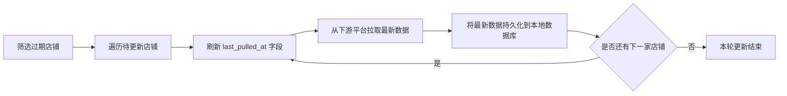
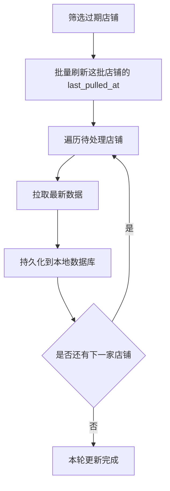

> 前情提要：[《后端日记--索引漂移》]()

## 引言

其实小罗在做这个定期批量更新的逻辑时，还遇到了一个问题，为了提高更新效率，小罗在k8s上开了3个pod执行相同的逻辑。然后查看指标，发现确实每个容器更新速率都是25家/s(三个容器就是75家/s略高于40000/600 = 66.7家/s的最低要求)，但是实际上却有很多店铺没能在10分钟内完成更新（事实上，更新效率和单个pod的理论值较为接近），这又是为何🤔

## 更新流程

其实要是读者较为有经验，看了整个更新流程再结合标题就能知道问题出在哪里了，但是我还是把整个流程写下来吧，谁让小罗还是一个后端萌新呢😂：

更新流程如下：

其中，筛选过期店铺经过索引优化后，耗时约为 10ms 量级；拉取最新数据约为每家店铺 250ms；持久化耗时约为 10ms 量级。

## 问题所在

问题就出在，本来应该同时刷新的last_pulled_at字段被分摊到了若干次店铺串行地执行了，这意味着每家店铺想要刷新自己的last_pulled_at字段还要等待上家店铺的拉取最新数据和持久化到本地数据库的操作执行完。但是小罗是没有在这一系列操作中使用到事务的，只是在三个pod的定时任务中添加了随机化参数，让它们在1s的周期内随机时刻开始定时任务，本来要是每家店铺的last_pulled_at字段能及时更新（大约几十ms）那么三个pod就几乎不会更新到同样的店铺（因为上一个pod在下一个pod开始筛选过期店铺前就已经完成它更新的店铺的last_pulled_at字段的刷新了），可是现在，一家店铺更新的比较靠后的店铺的last_pulled_at字段刷新收到了很长时间的阻塞（甚至多于1s！），那么就会导致比较靠后的店铺几乎必定会被后面的pod重复更新！

## 解决方案

相信聪明的读者早就知道解决方案了：将店铺的last_pulled_at字段刷新逻辑从先前的一个个店铺刷新然后拉取新数据再持久化改为同时刷新所有店铺的last_pulled_at字段。也就类似于下面的流程图：

小罗在画这个流程图的时候突然间发现，其实拉取新数据是可以并行的！但是现在的版本也已经解决了**并发写冲突**了，那就不改了吧🙂‍↔️
